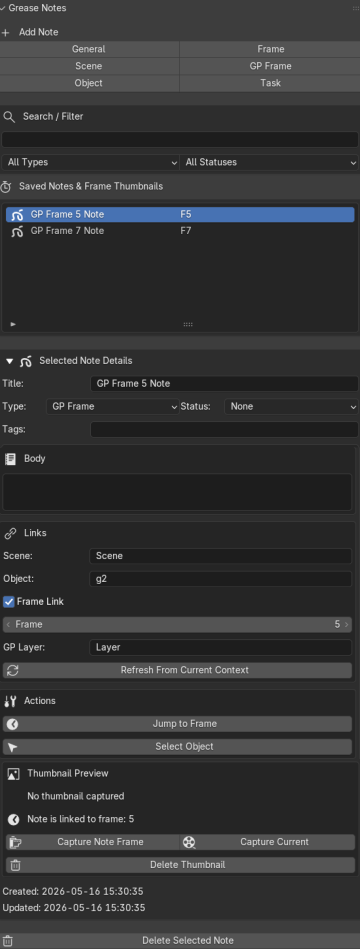

# Grease Notes

**Grease Notes** is a Blender 5.1 extension for creating notes, reminders, and visual frame references directly inside Blender.

It is designed for general Blender work and Grease Pencil animation workflows. You can create notes linked to scenes, objects, frames, and Grease Pencil context, with optional viewport thumbnails for quick visual reference.

---

## What Grease Notes Is For

Grease Notes helps you keep track of what is happening in your Blender project.

Use it for:

- Frame notes
- Scene notes
- Object notes
- Grease Pencil animation reminders
- Cleanup tasks
- Material notes
- Shot notes
- Reference notes
- Visual reminders using optional thumbnails

Grease Notes is especially useful when working on Grease Pencil animation because it lets you quickly document what is happening on important frames.

---

## What Grease Notes Is Not

Grease Notes is **not** a Grease Pencil drawing storage system.

It does not try to:

- Store reusable Grease Pencil drawings
- Replace Blender’s Asset Browser
- Manage Grease Pencil layers
- Copy/paste Grease Pencil frame data
- Act as a full animation manager
- Automatically understand every layer or drawing in a frame

It is a note-taking and reminder tool.

The user remains in control of the drawing, animation, layer organization, and project structure.

---

## Where to Find It

After installing and enabling the extension, open the:

```text
3D Viewport
└─ Sidebar / N-panel
   └─ Grease Notes tab
```

Press **N** in the 3D Viewport if the sidebar is hidden.

---

## Basic Workflow

1. Go to the frame, object, scene, or view you want to document.
2. Open the **Grease Notes** panel in the 3D Viewport sidebar.
3. Create a note.
4. Add a clear title.
5. Write the note body.
6. Optionally capture a viewport thumbnail.
7. Later, use the note to jump back to the frame, select the linked object, or remember what needs to be done.

Example:

```text
Title: Mouth Open Shape
Frame: 24
Object: Character_GP
Body: This is the strong A/E mouth shape. Clean up lower lip later.
Thumbnail: optional viewport snapshot
```

---

## Screenshot



## Note Types

Grease Notes supports several note types:

| Note Type     | Purpose                                     |
| ------------- | ------------------------------------------- |
| General       | A normal note not tied to anything specific |
| Scene         | Notes about the current scene               |
| Object        | Notes linked to the selected object         |
| Frame         | Notes linked to the current timeline frame  |
| GP Frame      | Notes intended for Grease Pencil frame work |
| Task          | Todo or cleanup reminder                    |
| Material      | Notes about material/shader work            |
| Camera / Shot | Notes about camera framing or shot planning |

You can still use any note type however you want. The types are there for organization, not strict rules.

---

## Creating Notes

The add-note buttons create notes with different default context.

Typical buttons may include:

| Button            | What It Does                                                  |
| ----------------- | ------------------------------------------------------------- |
| Add General Note  | Creates a basic note                                          |
| Add Scene Note    | Links the note to the current scene                           |
| Add Object Note   | Links the note to the selected object                         |
| Add Frame Note    | Links the note to the current timeline frame                  |
| Add GP Frame Note | Links the note to the current frame and Grease Pencil context |
| Add Task Note     | Creates a task-style reminder                                 |

---

## Saved Notes & Frame Thumbnails Section

This section lists your saved notes.

Each note entry shows useful reference information such as:

- Note title
- Linked frame number, if available
- Thumbnail indicator or preview, if available

The title and frame number are usually enough to identify the note quickly. The thumbnail is an optional visual helper.

---

## Selected Note Details Section

When a note is selected, the details section lets you view or edit the note.

Common fields include:

| Field         | Purpose                                           |
| ------------- | ------------------------------------------------- |
| Title         | Short name for the note                           |
| Body          | Main note text                                    |
| Type          | Note category                                     |
| Status        | Optional progress/status label                    |
| Tags          | Searchable keywords                               |
| Linked Frame  | Timeline frame linked to the note                 |
| Linked Object | Object linked to the note                         |
| GP Layer      | Active Grease Pencil layer recorded when relevant |

---

## Body and Tags

The **Body** field is for the main note. Use it for the full explanation, reminder, task, or animation comment.

The **Tags** field is for short keywords.

Example:

```text
Body:
This frame uses the mouth, eyes, and brows layers.
The mouth shape is good, but the lower lip needs cleanup.

Tags:
mouth, eyes, brows, cleanup
```

---

## Grease Pencil Layer Behavior

For Grease Pencil notes, Grease Notes records the **active Grease Pencil layer** as a reference label.

This means:

```text
If the active layer is Mouth when the note is created,
the note records Mouth as the GP layer.
```

If several Grease Pencil layers are visible in the viewport, the thumbnail can still show all visible layers because the thumbnail is captured from the active 3D Viewport.

However, the GP Layer field is not a full multi-layer tracker. It is only a helpful reference to the active layer at the time of note creation or update.

Example:

```text
Visible layers:
- Face
- Mouth
- Eyes
- Brows

Active layer:
- Mouth

Recorded GP Layer:
- Mouth
```

If a note is about multiple layers, write that clearly in the note body.

Example:

```text
Title:
Full Face Expression - Happy

GP Layer:
Mouth

Body:
This expression uses Mouth, Eyes, Brows, and Face Guide layers.
The viewport thumbnail shows all visible layers.
```

This keeps Grease Notes simple and avoids turning it into a Grease Pencil layer manager.

---

## Viewport Thumbnails

Thumbnails are optional.

A note can have no thumbnail and still be useful.

Grease Notes captures thumbnails from the **active 3D Viewport**. It captures what the user is currently seeing in the viewport.

This makes thumbnails useful as quick visual memos, not final renders.

Use thumbnails for:

- Grease Pencil frame reminders
- Pose references
- Shot composition notes
- Cleanup reminders
- Object placement notes
- Before/after visual checks

---

## Capture Note Frame vs Capture Current

Grease Notes provides two thumbnail capture behaviors.

| Button             | Meaning                                            |
| ------------------ | -------------------------------------------------- |
| Capture Note Frame | Captures the frame linked to the selected note     |
| Capture Current    | Captures the current active Blender timeline frame |

### Capture Note Frame

If the selected note is linked to frame 3, and Blender is currently on frame 4, this option captures frame 3.

The extension temporarily goes to the note’s linked frame, captures the viewport thumbnail, then returns to the previous frame.

Example:

```text
Current Blender frame: 4
Selected note frame: 3
Button: Capture Note Frame
Captured frame: 3
```

### Capture Current

This captures whatever frame Blender is currently on.

Example:

```text
Current Blender frame: 4
Selected note frame: 3
Button: Capture Current
Captured frame: 4
```

---

## Thumbnail Actions

| Action           | Result                                   |
| ---------------- | ---------------------------------------- |
| Add Thumbnail    | Adds a viewport snapshot to the note     |
| Update Thumbnail | Replaces the note’s current thumbnail    |
| Delete Thumbnail | Removes only the thumbnail, not the note |

Deleting a thumbnail does not delete the note.

---

## Note Actions

Common actions include:

| Action        | Result                                        |
| ------------- | --------------------------------------------- |
| Jump to Frame | Moves the timeline to the note’s linked frame |
| Select Object | Selects the note’s linked object              |
| Edit Note     | Updates the note fields                       |
| Delete Note   | Deletes the selected note                     |

---

## Delete Behavior

Grease Notes follows normal Blender-style deletion behavior.

Deleted notes or thumbnails are removed from the project data. They do not go to the operating system recycle bin.

Use Blender’s undo system if you delete something by mistake during the current session.

```text
Delete note → removed from Grease Notes
Ctrl + Z → restore, if still available in Blender undo history
Save file → deletion becomes part of the saved file
```

---

## Search and Filter

Use search and filter tools to find notes quickly.

Good tag examples:

```text
mouth
blink
cleanup
camera
pose
material
fx
shot
todo
final
rough
```

Suggested status labels:

```text
Todo
Doing
Cleanup
Final
Reference
Problem
```

---

## Grease Pencil Workflow Tips

Grease Notes works well with a simple Grease Pencil reference-layer workflow.

Many users create reference layers where reusable drawings are stored, then copy drawings from those layers when needed.

For example:

```text
REF_Mouth_Shapes
REF_Eyes_Blinks
REF_Hands
REF_Impact_FX
REF_Smears
REF_Expressions
```

Tips:

- Give reference layers clear names.
- Use prefixes like `REF_`, `GUIDE_`, or `STASH_`.
- Keep reusable drawings on organized reference layers.
- Use Grease Notes to document important frames, shapes, and cleanup tasks.
- Use thumbnails as quick visual reminders, not as final artwork previews.
- Write multi-layer context in the note body when needed.

Example note:

```text
Title:
Blink Reference

Frame:
16

GP Layer:
Eyes

Body:
Blink shape stored on REF_Eyes_Blinks.
Use this as the base for quick eye closures.
The brows layer may need adjustment when using this expression.

Tags:
eyes, blink, reference
```

---

## General Blender Workflow Tips

Grease Notes is also useful outside Grease Pencil.

Examples:

```text
Object Note:
Tree_01 needs better leaf material transparency.

Material Note:
Spider_Silk should be more translucent and less plastic.

Camera Note:
Camera angle works well, but character silhouette needs more space.

Task Note:
Fix clipping on left hand before final render.
```

Use notes to reduce the need to remember everything mentally while working.

---

## Storage

Grease Notes stores its note data inside the `.blend` file.

This means the notes travel with the project file.

Thumbnails are also intended to be stored with the Blender project data, so users do not need to manage a separate folder for basic use.

---

## Recommended Use

Use Grease Notes as a project memory layer.

Good usage:

```text
- Mark important animation frames
- Record cleanup tasks
- Add reminders for objects/materials
- Save viewport thumbnails for quick reference
- Document Grease Pencil frame context
- Keep notes close to the work inside Blender
```

Avoid expecting it to automatically manage every part of the project.

Grease Notes is most effective when the user gives notes clear titles, useful tags, and direct descriptions.
